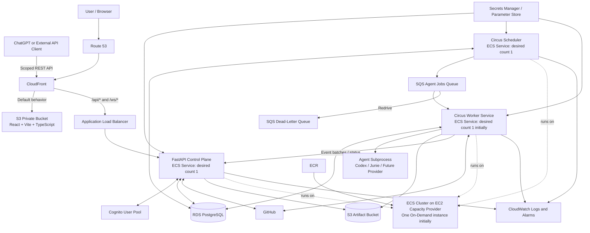
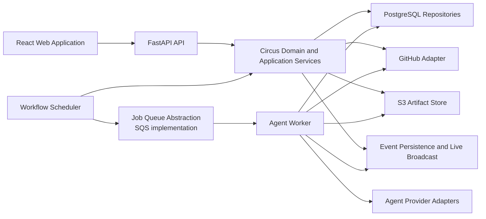
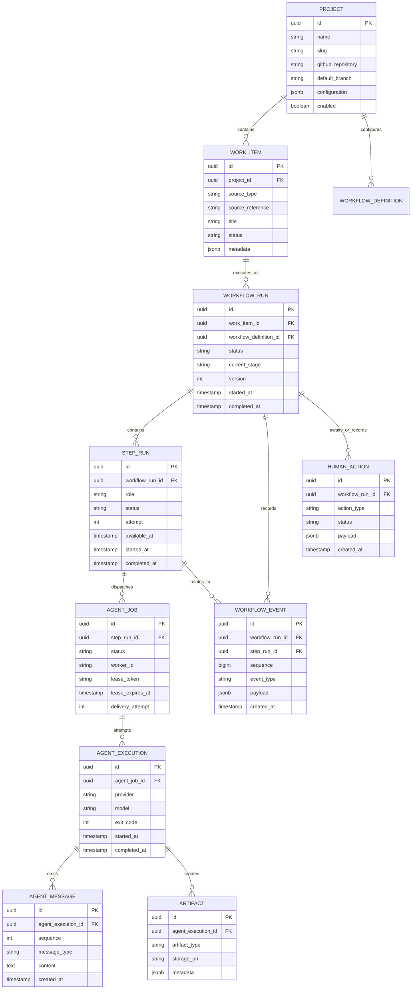
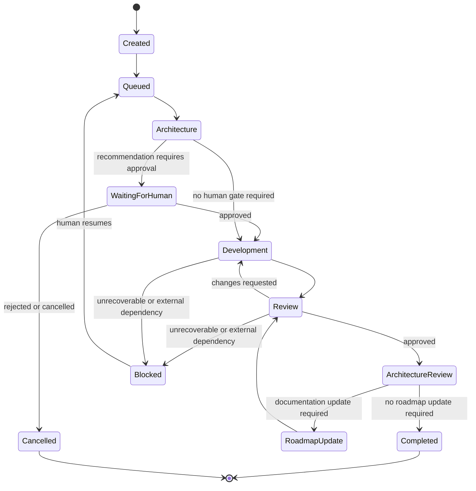
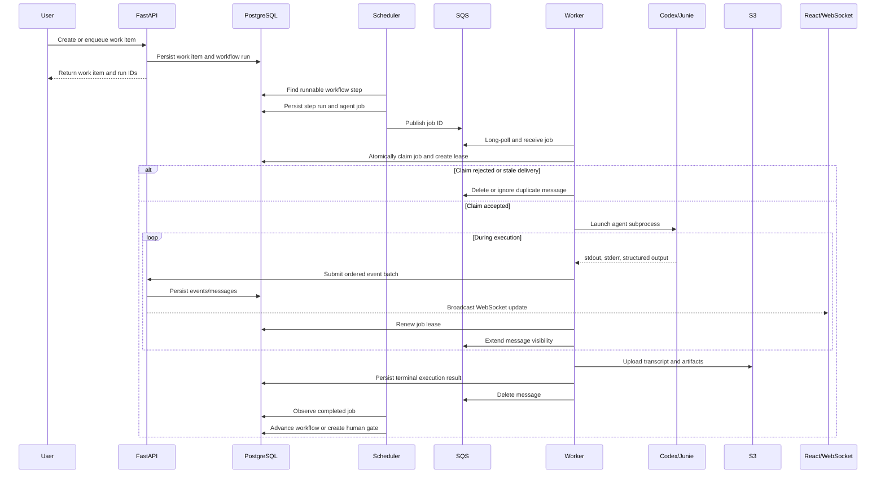
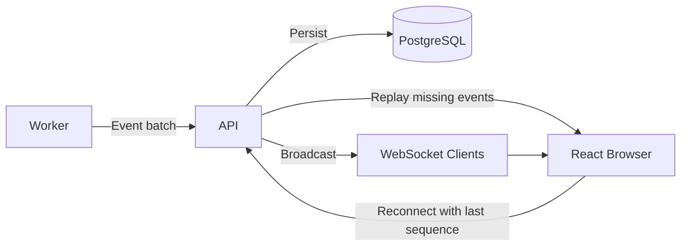

# Circus v2 Target Architecture

**Status:** Proposed target architecture for Systems Architect review  
**Purpose:** Define the intended architectural direction for evolving Circus from a GitHub-label-driven automation process into an AWS-hosted agent orchestration platform.

---

## 1. Architectural intent

Circus began as a GitHub-centered automation process:

- GitHub issues supplied work.
- GitHub labels triggered execution and represented workflow state.
- Polling detected transitions.
- A Circus process selected a role and launched the associated agent.
- GitHub comments, branches, pull requests, and handoff files carried most durable history.

That design solved valuable early problems, especially remote control, visibility, and avoiding multiple local instances working on the same issue. Circus has now grown beyond the assumptions of that design.

The target Circus v2 architecture should instead be:

> A durable agent orchestration platform that integrates with GitHub, rather than a GitHub workflow script that launches agents.

GitHub remains important, but it becomes an integration boundary rather than Circus's workflow engine and distributed coordination system.

---

## 2. Core architectural principles

1. **PostgreSQL is authoritative for durable Circus state.**
2. **SQS delivers agent jobs but does not define workflow state.**
3. **The scheduler decides workflow progression but does not execute agents.**
4. **Workers execute jobs but do not decide the next workflow step.**
5. **Workers are replaceable; their local files are workspace and cache, not authoritative state.**
6. **S3 stores large and immutable artifacts.**
7. **GitHub remains authoritative for source collaboration, issues, branches, pull requests, and human review.**
8. **The Circus API is the common interface for the GUI, CLI, GitHub integration, and future ChatGPT integration.**
9. **WebSocket delivery is real-time convenience; persisted events provide reliability and replay.**
10. **The initial deployment may use one API, one scheduler, and one worker service without weakening the component boundaries.**

---

## 3. Target AWS infrastructure



### Initial capacity assumptions

- FastAPI service: one task.
- Scheduler service: one task.
- Worker service: one task with execution concurrency initially limited to one.
- ECS capacity: one On-Demand EC2 instance.
- RDS PostgreSQL: small single-AZ instance initially, with backups and a future Multi-AZ path.
- SQS: Standard queue plus dead-letter queue.
- Frontend: private S3 bucket behind CloudFront using Origin Access Control.
- Backend ingress: CloudFront behavior to ALB.
- Authentication: Cognito for the GUI; scoped service credentials for external API clients.
- Administrative access: Systems Manager Session Manager rather than public SSH.
- Networking should avoid a NAT Gateway initially if a secure public-subnet ECS-host arrangement can provide required outbound access.

---

## 4. Logical component boundaries



The code structure does not have to exactly match these names, but the responsibilities should remain separated.

### FastAPI control plane

Responsibilities:

- project management;
- project configuration;
- work-item intake;
- workflow commands;
- workflow history queries;
- human approvals and interventions;
- GitHub issue creation and synchronization;
- agent transcript and artifact access;
- WebSocket subscriptions;
- authentication and authorization;
- external API operations.

It should not directly execute agent subprocesses.

### Scheduler

Responsibilities:

- determine which workflow runs may advance;
- create step runs;
- evaluate branching and retry rules;
- enforce human gates;
- create agent jobs;
- persist dispatch state;
- publish job identifiers to SQS;
- react to terminal job results;
- reconcile jobs left incomplete after failures.

It should not clone repositories or launch Codex or Junie.

### Worker

Responsibilities:

- long-poll SQS;
- atomically claim an agent job in PostgreSQL;
- resolve project and execution configuration;
- prepare a repository clone or worktree;
- launch the chosen agent as a subprocess;
- capture stdout, stderr, structured messages, and lifecycle events;
- maintain a job lease and extend SQS visibility;
- upload durable artifacts;
- record a terminal result;
- acknowledge the SQS message.

It should not determine the workflow's next step.

---

## 5. Project model

Projects become first-class records rather than environment-variable-only configuration.

A project may include:

- display name and slug;
- GitHub owner and repository;
- default branch;
- workspace strategy;
- default workflow definition;
- role-to-agent-provider configuration;
- model and reasoning defaults;
- concurrency policy;
- credential references;
- repository-specific validation rules;
- enabled or disabled state.

Illustrative configuration:

```json
{
  "name": "The Circus",
  "slug": "the-circus",
  "repository": {
    "provider": "github",
    "full_name": "RedEagleSoftware/the-circus",
    "default_branch": "dev"
  },
  "workspace": {
    "strategy": "managed_worktree"
  },
  "workflow": {
    "default": "standard-development"
  },
  "roles": {
    "architect": {
      "provider": "codex",
      "model": "configured-at-runtime"
    },
    "developer": {
      "provider": "junie",
      "model": "configured-at-runtime"
    },
    "reviewer": {
      "provider": "codex",
      "model": "configured-at-runtime"
    }
  }
}
```

Secrets are referenced, not embedded.

---

## 6. Durable state model

The relational model should preserve important state in typed columns while allowing controlled flexibility through PostgreSQL `JSONB`.



The exact schema must be validated against the existing codebase and workflow concepts before implementation.

---

## 7. Workflow orchestration

Circus should preserve durable current state and an append-only workflow event history.



This is illustrative. The v1 Systems Architect should compare it to the actual current workflows, role handlers, state transitions, labels, and GitHub interactions.

---

## 8. Agent-job delivery and execution



---

## 9. SQS behavior

Initial queues:

- `circus-agent-jobs`
- `circus-agent-jobs-dlq`

Initial design:

- Standard queue;
- long polling;
- at-least-once delivery;
- conservative visibility timeout;
- worker heartbeat and visibility extension;
- bounded redrive count;
- message payloads containing identifiers rather than large prompts or secrets;
- database-backed idempotency and atomic job claims.

Illustrative message:

```json
{
  "schema_version": 1,
  "job_id": "uuid",
  "step_run_id": "uuid",
  "project_id": "uuid",
  "role": "developer",
  "attempt": 1
}
```

A duplicate delivery must be harmless.

---

## 10. Real-time process visibility

The UI should provide:

- project dashboard;
- active workflow runs;
- complete project history;
- current stage and status;
- role and provider currently executing;
- readable agent conversation;
- raw process output;
- workflow event timeline;
- artifacts;
- GitHub links;
- pending human actions;
- retry, cancel, resume, and approve controls where authorized.

Real-time delivery:



The persisted sequence is authoritative. WebSocket delivery may be lost during a restart without losing history.

---

## 11. GitHub integration boundary

GitHub should remain responsible for:

- issue content and discussion;
- branches and commits;
- pull requests;
- repository authorization;
- human code review;
- source collaboration.

Circus should become responsible for:

- work admission;
- workflow progression;
- agent assignment;
- retries;
- leases;
- execution state;
- transcripts;
- project configuration;
- process history;
- human orchestration gates.

Potential intake mechanisms:

- Circus GUI;
- Circus REST API;
- Circus CLI;
- ChatGPT action or app;
- GitHub comment command;
- one simple GitHub opt-in label;
- GitHub App webhook.

Detailed GitHub state labels should be retired gradually. A small human-facing projection may remain, such as:

- `circus:queued`
- `circus:running`
- `circus:needs-human`
- `circus:blocked`
- `circus:complete`

---

## 12. Workspace and local state

Worker-local storage is appropriate for:

- repository clones;
- Git worktrees;
- dependency caches;
- temporary prompt files;
- build and test output;
- current process buffers;
- provider CLI files.

Worker-local storage must not be the only location for:

- workflow status;
- recommendations and approvals;
- handoffs;
- decision logs;
- terminal execution results;
- complete process history;
- irreplaceable source changes.

The target should support a managed workspace strategy that the Systems Architect must reconcile with the existing worktree implementation.

---

## 13. Security and operational baseline

The initial platform should include:

- Cognito authentication for the web application;
- scoped API credentials for machine clients;
- task-specific IAM roles;
- Secrets Manager or Parameter Store references;
- private S3 buckets;
- CloudFront Origin Access Control;
- encrypted RDS and S3 storage;
- RDS backups and point-in-time recovery;
- CloudWatch logs and basic alarms;
- SQS dead-letter queue monitoring;
- Systems Manager Session Manager;
- no public database access;
- no public SSH requirement;
- least-privilege GitHub credentials where feasible.

---

## 14. Explicitly deferred capabilities

The initial design intentionally defers:

- multiple FastAPI replicas;
- multiple active schedulers;
- Redis or Valkey fan-out;
- EFS shared workspaces;
- Multi-AZ RDS;
- worker autoscaling;
- multiple EC2 hosts;
- per-role SQS queues;
- Kubernetes;
- Step Functions as the primary Circus workflow engine.

The architecture should allow these later without requiring them now.

---

## 15. Questions for Systems Architect validation

The v1 Systems Architect should explicitly evaluate:

1. Which current modules already correspond to the proposed API, scheduler, worker, provider, GitHub, and domain boundaries?
2. Which components are too tightly coupled to GitHub labels, polling, environment variables, or local paths?
3. Which state currently exists only in labels, comments, files, process memory, or working directories?
4. Which existing workflow transitions must be preserved?
5. How should current handoff and decision-log files map to database records and S3 artifacts?
6. How should the existing worktree strategy evolve into a multi-project worker workspace manager?
7. Which operations require strict idempotency or optimistic concurrency?
8. What is the safest compatibility layer while GitHub labels remain active?
9. Which infrastructure assumptions create unnecessary cost or operational risk?
10. What sequencing minimizes a disruptive rewrite?
