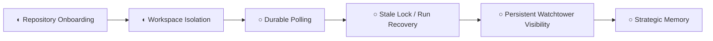

# Capability Tree

Systems Architect stewardship: capability-tree planning and sequencing are owned as a strategic function by the Systems Architect role.

Approved issue #19 direction: keep The Circus focused on the `Self Hosting` frontier before expanding `Provider Routing` or `Skills`.
Approved issue #30 direction: use Git worktrees as the primary isolation mechanism for normal mutation-capable agent execution.
The next capability frontier is **self-hosting reliability and strategic memory**.

## Current Frontier

## Workflow Foundation

## Self Hosting

Self Hosting now means reliable repeated execution across fresh sessions without hidden context drift.
The approved sequence is repository onboarding, workspace isolation, durable polling, stale-lock/run recovery, and persistent Watchtower visibility.

## Agent Evolution

Provider routing and skills remain valid future capabilities, but they are intentionally deferred until self-hosted execution is reliable enough to observe, recover, and preserve strategic context across repeated runs.

## Workspace Isolation

Workspace Isolation is now an accepted Self Hosting capability direction, based on the approved Systems Architect recommendation in issue #30.

The accepted architecture is:

- `CIRCUS_TARGET_REPO_PATH` remains the canonical local repository and source for worktrees.
- Normal mutation-capable agent execution should run from deterministic per-item Git worktrees, not directly from the shared target repository checkout.
- The default workspace root should be configurable as `CIRCUS_WORKTREE_ROOT`; when omitted, it should resolve beside the target repo, for example `<target-parent>/<target-repo-name>-worktrees`.
- Worktree paths should include a sanitized repository slug, then an item workspace such as `issue-30` or `pr-30`.
- The first implementation boundary is developer and roadmap-updater execution, because those workflows create branches, write files, commit, and push.
- Dirty or unexpected worktrees should block rather than be reset automatically.

Detailed architecture: [Worktree Isolation](worktree-isolation.md).
