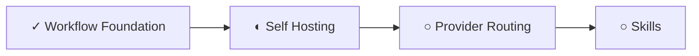
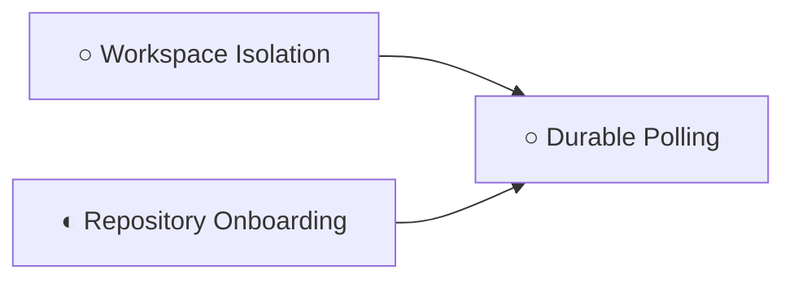
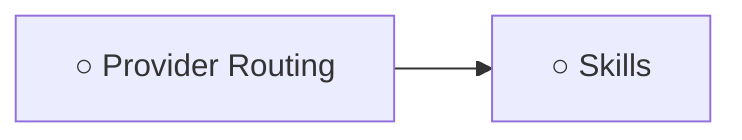

# Capability Tree

Systems Architect stewardship: capability-tree planning and sequencing are owned as a strategic function by the Systems Architect role.

## Current Frontier

## Workflow Foundation

## Self Hosting

## Agent Evolution

