# Capability Tree

Systems Architect stewardship: capability-tree planning and sequencing are owned as a strategic function by the Systems Architect role.

Approved issue #19 direction: keep The Circus focused on the `Self Hosting` frontier before expanding `Provider Routing` or `Skills`.
Approved issue #30 direction: use Git worktrees as the primary isolation mechanism for normal mutation-capable agent execution.
Approved issue #34 direction: add explicit dependency blocking as a Handler-owned scheduling capability before broad parallel execution.
Approved issue #37 direction: add Implementation Planning as a distinct review-gated bridge from accepted strategy to generated implementation issues.
Approved issue #64 direction: add a formal Planner Outcome Model with `READY`, `BLOCKED`, and `ESCALATION_REQUIRED` outcomes.
Approved issue #59 direction: formalize circular planning and complexity-based routing as workflow governance doctrine before runtime routing automation.
Approved issue #51 direction: formalize worktree and branch lifecycle management around conservative inventory, recovery, and cleanup safety rules.
Approved issue #54 direction: implement the first lifecycle slice as a read-only workspace inventory and lifecycle classification service.
The next capability frontier is **self-hosting reliability and strategic memory**.

## Current Frontier

## Workflow Foundation

## Self Hosting

Self Hosting now means reliable repeated execution across fresh sessions without hidden context drift.
The approved sequence is repository onboarding, workspace isolation, durable polling, dependency blocking, worktree/branch lifecycle management, stale-lock/run recovery, persistent Watchtower visibility, strategic memory, implementation planning with explicit outcome handling, and workflow governance for circular planning before routing automation.

```mermaid
flowchart LR
    onboarding["◐ Repository Onboarding"]
    workspace["◐ Workspace Isolation"]
    polling["○ Durable Polling"]
    dependency["○ Dependency Blocking"]
    lifecycle["○ Worktree / Branch Lifecycle"]
    recovery["○ Stale Lock / Run Recovery"]
    visibility["○ Persistent Watchtower Visibility"]
    memory["○ Strategic Memory"]
    planning["○ Implementation Planning"]
    governance["○ Workflow Governance"]

    onboarding --> workspace
    workspace --> polling
    polling --> dependency
    dependency --> lifecycle
    lifecycle --> recovery
    recovery --> visibility
    visibility --> memory
    memory --> planning
    planning --> governance
```

## Agent Evolution

Provider routing and skills remain valid future capabilities, but they are intentionally deferred until self-hosted execution is reliable enough to observe, recover, and preserve strategic context across repeated runs.

## Workspace Isolation

Workspace Isolation is now an accepted Self Hosting capability direction, based on the approved Systems Architect recommendation in issue #30.

The accepted architecture is:

- `CIRCUS_TARGET_REPO_PATH` remains the canonical local repository and source for worktrees.
- Normal mutation-capable agent execution should run from deterministic per-item Git worktrees, not directly from the shared target repository checkout.
- The default workspace root should be configurable as `CIRCUS_WORKTREE_ROOT`; when omitted, it should resolve beside the target repo, for example `<target-parent>/<target-repo-name>-worktrees`.
- Worktree paths should include a sanitized repository slug, then an item workspace such as `issue-30` or `pr-30`.
- The first implementation boundary is developer and roadmap-updater execution, because those workflows create branches, write files, commit, and push.
- Dirty or unexpected worktrees should block rather than be reset automatically.

Detailed architecture: [Worktree Isolation](worktree-isolation.md).

## Worktree and Branch Lifecycle Management

Worktree and Branch Lifecycle Management is now an accepted Self Hosting reliability capability direction, based on the approved Systems Architect recommendation in issue #51.

The accepted architecture is:

- One GitHub item maps to one deterministic workspace, one expected Circus branch, and zero or one open PR.
- GitHub remains the source of truth for workflow state and human decisions.
- Git remains the source of truth for repository, worktree, branch, upstream, and cleanliness facts.
- Watchtower records run history, workspace metadata, lifecycle classifications, diagnostics, and recommendation traceability, but does not become the authority for lifecycle state.
- Workspaces should be classified as `planned`, `ready`, `active`, `suspended`, `recoverable`, `stale-clean`, `retired`, `cleanup-eligible`, or `blocked-unsafe`.
- Recovery is inventory-first, combining Git worktree data, branch/upstream state, open PRs, workflow labels, and recent Watchtower run status before any repair or cleanup action.
- The issue #54 implementation slice separates inventory collection from classification policy and returns structured results with facts, reasons, and confidence or ambiguity signals.
- The issue #54 service is read-only and classification-only. It may produce diagnostics, but must not automate cleanup, deletion, reset, rebase, force-push, branch removal, worktree removal, recreation, or repair.
- Human approval is required before any action that deletes, resets, force-pushes, rebases, removes a branch, or removes a worktree.

Detailed architecture: [Worktree and Branch Lifecycle Management](worktree-lifecycle.md).

## Dependency Blocking

Dependency Blocking is now an accepted Self Hosting scheduling capability direction, based on the approved Systems Architect recommendation in issue #34.

The accepted architecture is:

- GitHub remains the source of truth for dependency metadata and workflow state.
- Dependencies are declared in a dedicated machine-readable issue body section headed `## Circus Dependencies` with marker `<!-- circus:dependencies v1 -->`.
- Handler owns dependency eligibility checks before dispatch, scheduler-managed transitions into `state:dependency-blocked`, and automatic unblocking when all prerequisites are satisfied.
- Watchtower records dependency decisions and status for observability, but does not become the authority for dependency state.
- `state:dependency-blocked` is distinct from human-owned `state:blocked`.
- Each issue keeps exactly one primary `state:*` label; dependency metadata carries `resume_state` so Handler can restore the intended dispatch label after unblocking.
- V1 satisfaction is conservative: issues satisfy dependencies only when closed completed, and pull requests satisfy dependencies only when merged.
- Issues without a `## Circus Dependencies` section remain eligible under normal workflow rules; fail-closed handling for missing, malformed, inaccessible, unsafe, or cyclic metadata applies when dependency intent is declared or unblocking is being evaluated.

Detailed architecture: [Issue Dependency Blocking](dependency-blocking.md).

## Implementation Planning

Implementation Planning is now an accepted Self Hosting / Strategic Memory capability direction, based on the approved Systems Architect recommendations in issues #37 and #64.

The accepted architecture is:

- Implementation Planning is a distinct workflow role, not an extension of Systems Architect, Roadmap Updater, Feature Architect, or Handler.
- Implementation Planning happens after roadmap updates, so accepted strategic intent is recorded in durable documentation before issue trees are generated.
- The Implementation Planner owns planner outcome declaration, issue decomposition for successful plans, initial sequencing, dependency declaration, generated GitHub issue creation for `READY`, and the plan/blocker/escalation review artifact.
- Every planner result declares exactly one outcome: `READY`, `BLOCKED`, or `ESCALATION_REQUIRED`.
- `READY` means implementation planning succeeded and the output is reviewable as executable backlog.
- `BLOCKED` means planning cannot safely complete because required planning inputs or operations are unavailable, stale, inaccessible, unsafe, or contradictory, but no new systems architecture decision is required.
- `ESCALATION_REQUIRED` means implementation planning would force systems-level decisions that belong to Systems Architect.
- Generated issues should be created directly in GitHub only for `READY`, and in a non-dispatch state such as `state:planned` or another plan-review state.
- Generated issues should include source traceability, implementation scope, acceptance criteria, suggested next workflow state, and optional `## Circus Dependencies` metadata where ordering matters.
- Blocked and escalation results should not create generated issues by default.
- The v1 outcome model reuses existing workflow states instead of adding outcome labels.
- Human approval is required before generated issues become dispatchable.
- Handler remains responsible for workflow label transitions, dispatch eligibility, dependency blocking, and automatic unblocking.
- Watchtower records planning artifacts and generated issue links for observability only.

Detailed architecture: [Implementation Planning](implementation-planning.md).

## Workflow Governance and Routing Doctrine

Workflow Governance is now an accepted Self Hosting / Strategic Memory capability direction, based on the approved Systems Architect recommendation in issue #59.

The accepted architecture is:

- Circular planning should be represented through human-visible recommendations, durable artifacts, and Handler-mediated workflow transitions.
- Handler remains the only workflow state authority; workflow roles may recommend blockers, returns, escalations, and decomposition changes, but do not mutate labels directly.
- Systems Architect owns strategic direction and unresolved system-level decisions.
- Roadmap Updater owns durable documentation synchronization after accepted strategy.
- Implementation Planner owns decomposition of accepted documented strategy into generated implementation issues.
- Feature Architect owns implementation handoff for one sufficiently scoped issue and may flag oversized, risky, blocked, or under-specified work for human/Handler routing.
- Complexity-based routing starts as advisory vocabulary: `implementation_complexity`, `safety_risk`, `slice_size`, and `architecture_uncertainty`.
- Automatic model selection, effort routing, reviewer-depth changes, and extra review gates remain deferred until self-hosting reliability, implementation planning, and Watchtower traceability are mature enough to support them.

Detailed architecture: [Workflow Governance and Routing Doctrine](workflow-governance.md).
