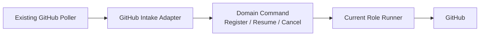
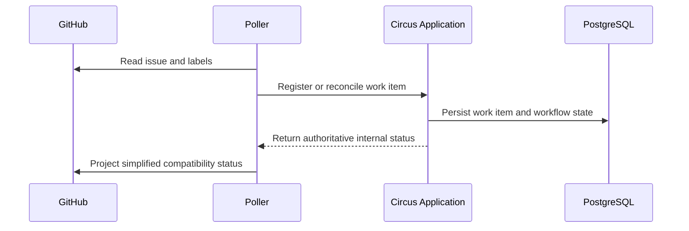
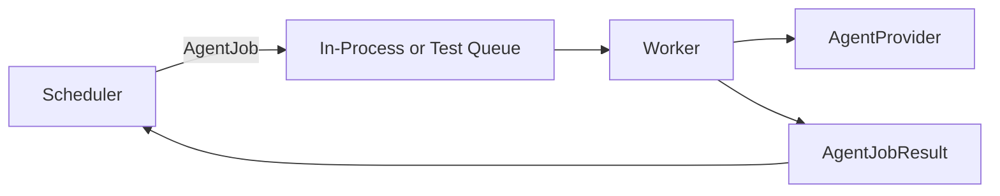
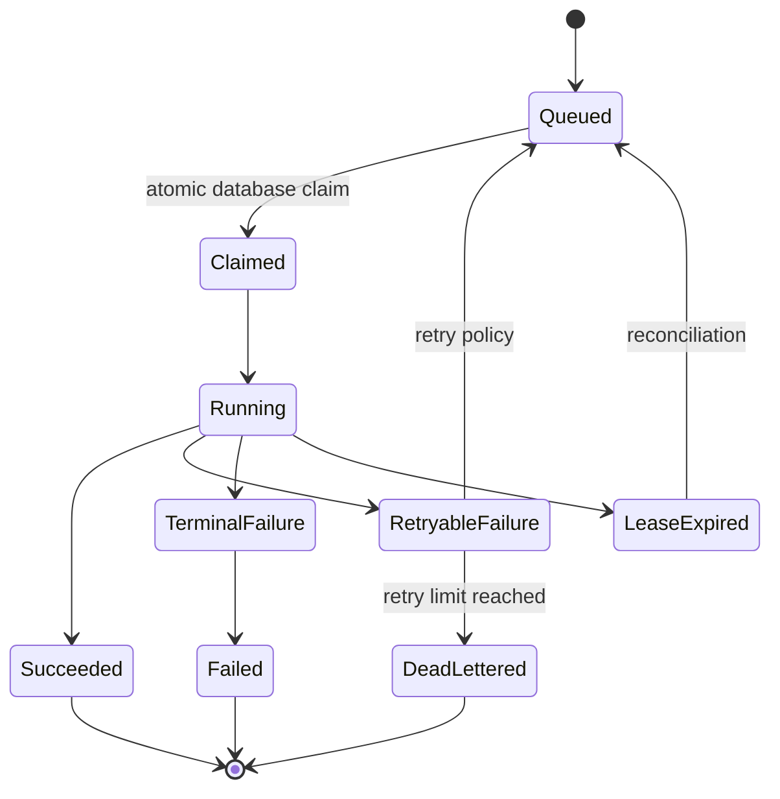
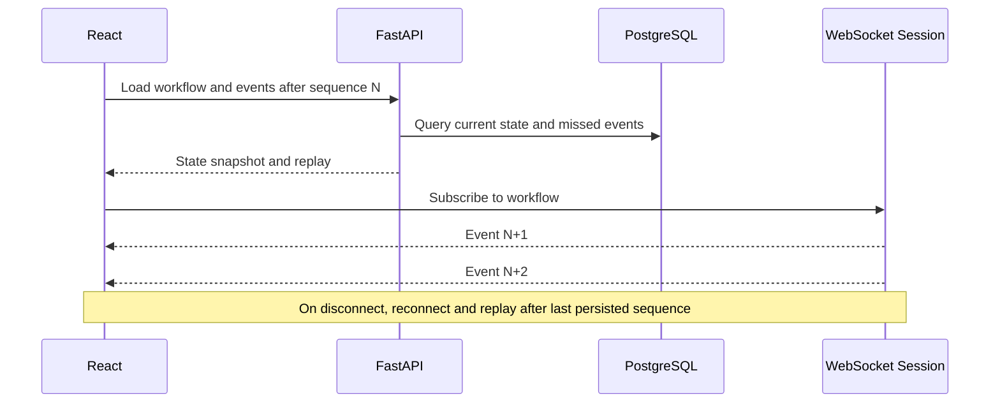
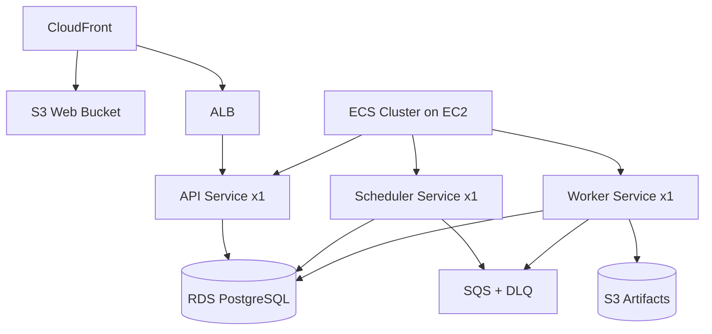
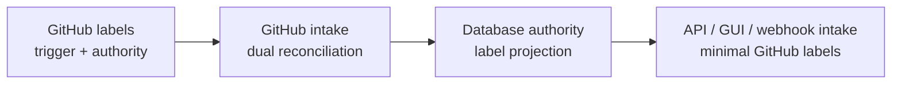

# Circus v2 Evolution Roadmap

**Status:** Proposed roadmap for Systems Architect validation  
**Goal:** Evolve the current Circus codebase incrementally into an AWS-hosted orchestration platform while preserving the existing working agent workflow.

---

## 1. Roadmap strategy

This roadmap is intentionally migration-oriented rather than greenfield-oriented.

The current Circus already performs valuable work:

- identifying eligible GitHub issues and pull requests;
- choosing role-specific handlers;
- running architecture, development, review, architecture-review, and roadmap-update workflows;
- creating and managing worktrees;
- invoking Codex and Junie;
- producing handoffs and decision logs;
- updating GitHub labels, comments, branches, and pull requests.

The roadmap should preserve that value while gradually replacing GitHub labels as the authoritative state machine.

```mermaid
flowchart LR
    V1[Current Circus<br/>GitHub labels + polling<br/>single process orientation]
    F1[Foundation<br/>domain model + durable IDs]
    F2[Durable State<br/>PostgreSQL + event history]
    F3[Execution Separation<br/>scheduler + worker contract]
    F4[AWS Messaging<br/>SQS + leases + idempotency]
    F5[Control Plane<br/>FastAPI + React + WebSockets]
    F6[AWS Runtime<br/>ECS + RDS + S3 + CloudFront]
    F7[GitHub Decoupling<br/>labels become projection]
    V2[Circus v2<br/>multi-project orchestration platform]

    V1 --> F1 --> F2 --> F3 --> F4 --> F5 --> F6 --> F7 --> V2
```

The Systems Architect may reorder or split phases after analyzing the repository.

---

## 2. Phase 0 — Repository and workflow inventory

### Objective

Create a verified picture of the current implementation before changing architectural ownership.

### Deliverables

- module and package map;
- entry points and process lifecycle;
- current polling and candidate-selection flow;
- label-to-handler/state-transition map;
- role and provider execution map;
- GitHub read/write inventory;
- environment-variable and configuration inventory;
- worktree and branch lifecycle map;
- handoff, recommendation, decision-log, and artifact inventory;
- recovery, retry, and idempotency behavior;
- test coverage and architectural seams;
- list of known production problems, including repeated comments on planned issues.

### Exit criteria

- Every current workflow state and transition is documented.
- Every authoritative piece of state has a known current storage location.
- v2 compatibility requirements are explicit.
- Unknowns and risks are recorded for the v2 Systems Architect.

---

## 3. Phase 1 — Establish domain boundaries inside the current application

### Objective

Separate orchestration concepts from GitHub representation before introducing AWS infrastructure.

### Proposed concepts

- `Project`
- `WorkItem`
- `WorkflowDefinition`
- `WorkflowRun`
- `StepRun`
- `AgentJob`
- `AgentExecution`
- `WorkflowEvent`
- `Artifact`
- `HumanAction`
- `Workspace`

### Work

- introduce durable identifiers;
- create typed enums or value objects for workflow status and roles;
- define explicit transition rules;
- place GitHub label interpretation behind an intake or compatibility adapter;
- place GitHub mutations behind a GitHub port/adapter;
- create an agent-provider abstraction;
- create a workspace-manager abstraction;
- introduce a clock abstraction where leases and retries depend on time;
- preserve existing CLI and polling behavior.

### Compatibility rule

The existing poller may continue detecting work, but it should translate GitHub state into domain commands rather than directly deciding and executing every workflow transition.

### Exit criteria

- core workflow decisions can be tested without calling GitHub;
- role execution can be invoked through a stable interface;
- current behavior remains operational;
- no database is required yet for the domain tests.

---

## 4. Phase 2 — Add PostgreSQL persistence and migrations

### Objective

Make Circus state durable outside GitHub without immediately retiring labels.

### Infrastructure

- PostgreSQL locally through Docker Compose;
- migration tooling;
- repository layer;
- transactional application services;
- initial AWS-compatible database configuration.

### Work

- persist projects and project configuration;
- register GitHub issues and pull requests as work items;
- persist workflow runs and step runs;
- persist current status in typed columns;
- persist append-only workflow events;
- record agent executions and terminal results;
- record GitHub references;
- persist artifact metadata;
- add optimistic concurrency or version columns where required;
- define cleanup and retention policy.

### Transitional authority

During this phase:

- GitHub remains the intake trigger.
- PostgreSQL becomes the authoritative execution record once a work item is registered.
- GitHub labels may still be updated for compatibility and visibility.
- Reconciliation tooling should detect mismatches.

### Exit criteria

- process restarts do not lose registered workflow state;
- history can be queried without reading GitHub comments;
- duplicate poll cycles do not produce duplicate workflow records or repeated comments;
- label mismatches are observable.

---

## 5. Phase 3 — Extract scheduler and worker contracts

### Objective

Make workflow progression independent from agent execution.

### Scheduler contract

The scheduler:

- discovers runnable internal steps;
- evaluates transition rules;
- creates agent jobs;
- handles human gates;
- handles completed or failed jobs;
- creates retries according to policy;
- never launches provider subprocesses.

### Worker contract

The worker:

- claims one agent job;
- prepares a workspace;
- runs one configured role;
- emits ordered events;
- records artifacts;
- returns a terminal result;
- never chooses the next workflow step.

### Initial implementation

The scheduler and worker may initially run in the same development environment or process tree, but through explicit interfaces.

### Exit criteria

- a worker can be tested with a supplied job independent of polling;
- a scheduler can be tested with fake job dispatch and results;
- provider-specific execution is behind adapters;
- the current workflow can complete through the new contracts.

---

## 6. Phase 4 — Add SQS, leases, and idempotent job processing

### Objective

Introduce the production messaging boundary from the beginning of the AWS-capable architecture.

### Infrastructure

- `circus-agent-jobs`;
- `circus-agent-jobs-dlq`;
- local development queue adapter or LocalStack only if it provides enough value;
- SQS implementation of the queue port.

### Work

- publish identifier-only job messages;
- implement long polling;
- atomically claim jobs in PostgreSQL;
- use lease tokens and expiration;
- extend SQS visibility during execution;
- renew database leases;
- make duplicate deliveries harmless;
- define retryable versus terminal failures;
- implement dead-letter handling and administrative recovery;
- add cancellation checks;
- add worker heartbeats and stale-job reconciliation.

### Exit criteria

- duplicate SQS deliveries cannot execute one job concurrently;
- a crashed worker can be detected and recovered;
- stale queue messages are ignored safely;
- failed jobs have inspectable retry history;
- DLQ messages can be correlated to database records.

---

## 7. Phase 5 — Add event streaming and artifact storage

### Objective

Make all agent execution observable and replayable.

### Work

- define structured event types;
- assign monotonically increasing sequence numbers per execution or workflow;
- batch stdout and stderr;
- distinguish readable conversation messages from raw terminal output;
- persist events and message metadata in PostgreSQL;
- upload complete transcripts and large artifacts to S3;
- retain handoffs and decision logs as first-class artifacts;
- add checksum, size, type, and provenance metadata;
- define event replay endpoints;
- implement internal worker-to-API event submission.

### Exit criteria

- every active execution can be observed;
- reconnecting clients can retrieve missed events;
- raw logs are available without bloating ordinary workflow queries;
- historical handoffs remain accessible.

---

## 8. Phase 6 — Build the FastAPI control plane

### Objective

Create the stable interface through which all clients operate Circus.

### Initial API areas

- authentication;
- projects;
- work items;
- workflow runs;
- step runs;
- agent executions;
- events;
- artifacts;
- human actions;
- project configuration;
- GitHub issue creation;
- start, cancel, retry, resume, and approve commands;
- WebSocket subscriptions;
- health and readiness endpoints.

### Design requirements

- versioned external API;
- narrower internal worker API;
- generated OpenAPI schema;
- scoped authorization;
- idempotency keys for mutating external operations;
- pagination and filtering;
- structured error responses;
- correlation IDs;
- no arbitrary remote command endpoint.

### Chat integration operations

Potential future assistant-facing operations:

- list projects;
- create GitHub issue;
- create work item;
- start workflow;
- get status;
- inspect pending human actions;
- approve recommendation;
- cancel workflow;
- send human response.

### Exit criteria

- GUI and CLI can use the same application commands;
- external clients do not access the database directly;
- OpenAPI accurately represents supported integration operations;
- all mutations are authorized and auditable.

---

## 9. Phase 7 — Build the React control-plane UI

### Objective

Provide a project-oriented operational view of Circus.

### Frontend stack

- React;
- Vite;
- TypeScript;
- established component and query libraries selected during implementation;
- static deployment to private S3 through CloudFront.

### Initial views

1. **Project list**
   - status summary;
   - active runs;
   - waiting-for-human count;
   - failed or blocked count.

2. **Project dashboard**
   - active workflows;
   - recent history;
   - queued work;
   - project configuration;
   - GitHub repository links.

3. **Workflow run**
   - current stage;
   - step timeline;
   - agent conversations;
   - raw terminal stream;
   - artifacts;
   - GitHub issue and PR links;
   - pending actions;
   - retry, cancel, resume, or approve controls.

4. **Create work**
   - select project;
   - create or select GitHub issue;
   - select workflow;
   - supply initial instructions;
   - enqueue.

5. **Operations**
   - worker health;
   - queue depth;
   - stale leases;
   - DLQ records;
   - recent failures.

### Real-time behavior

### Exit criteria

- one user can manage all configured projects remotely;
- current agent work is visible in real time;
- complete project history is navigable;
- human gates can be resolved through the UI.

---

## 10. Phase 8 — Provision the initial AWS platform

### Objective

Deploy the intended production-shaped infrastructure at small scale.

### Infrastructure inventory

#### Frontend

- private S3 web bucket;
- CloudFront;
- Origin Access Control;
- ACM certificate;
- Route 53 alias;
- SPA error fallback;
- `/api/*` and `/ws/*` backend behaviors with caching disabled.

#### Compute

- ECS cluster;
- EC2 Auto Scaling Group with one On-Demand instance;
- ECS capacity provider;
- ECR repositories;
- API ECS service;
- scheduler ECS service;
- worker ECS service;
- ALB;
- task definitions with resource reservations.

#### Data and messaging

- RDS PostgreSQL;
- S3 artifact bucket;
- SQS queue;
- SQS dead-letter queue.

#### Security and operations

- Cognito;
- Secrets Manager or Parameter Store;
- IAM task and execution roles;
- security groups;
- Systems Manager;
- CloudWatch log groups;
- queue, service, host, and database alarms;
- database backups.

### Deployment model

### Exit criteria

- the full platform can be deployed reproducibly;
- services can restart independently;
- no durable workflow state depends on a container or EC2 disk;
- frontend, API, scheduler, and worker have independent deployment paths;
- operating cost and resource utilization are observable.

---

## 11. Phase 9 — Migrate workflow authority away from GitHub labels

### Objective

Make the Circus database the undisputed state machine while preserving a useful GitHub projection.

### Migration stages

1. Labels remain intake and state compatibility.
2. Labels remain intake, but PostgreSQL owns execution after registration.
3. Circus writes simplified status labels one-way.
4. Direct GUI, API, CLI, and webhook intake become primary.
5. Detailed legacy workflow labels are deprecated and removed.

### Exit criteria

- removing or changing a projection label cannot corrupt a workflow;
- polling is no longer the core orchestration engine;
- repeated no-op polls cannot create repeated comments;
- internal history is complete without reconstructing GitHub activity.

---

## 12. Phase 10 — Multi-project and controlled concurrency

### Objective

Safely execute multiple projects and agent jobs on shared infrastructure.

### Work

- project-specific credentials and configuration;
- workspace isolation;
- repository locking and conflict policy;
- global and per-project concurrency limits;
- provider quota policy;
- role-specific resource requirements;
- worker capability advertisement;
- job routing constraints;
- cancellation and preemption rules;
- branch and pull-request collision prevention.

### Exit criteria

- two unrelated repositories can execute concurrently;
- two jobs cannot accidentally mutate the same workspace;
- project limits and provider quotas are enforced;
- the UI shows all active processes globally and per project.

---

## 13. Later scaling options

These are not required for the initial v2 platform:

- multiple API replicas;
- Redis or Valkey WebSocket fan-out;
- multiple schedulers with leader election or distributed claims;
- worker autoscaling based on SQS depth;
- multiple EC2 worker hosts;
- Fargate workers;
- Spot worker capacity;
- per-role queues;
- EFS or workspace snapshot restoration;
- Multi-AZ RDS;
- read replicas;
- cross-region disaster recovery.

They should remain architectural options rather than immediate implementation requirements.

---

## 14. Cross-cutting workstreams

### Testing

- domain transition tests;
- persistence integration tests;
- SQS duplicate-delivery tests;
- lease-expiration tests;
- provider-adapter contract tests;
- worker crash-recovery tests;
- GitHub compatibility tests;
- WebSocket reconnect and replay tests;
- infrastructure smoke tests;
- end-to-end workflow tests.

### Observability

- correlation IDs across API, scheduler, queue, worker, and GitHub;
- structured logs;
- workflow and job metrics;
- queue age and depth;
- lease-expiration count;
- retry and DLQ count;
- agent duration and exit code;
- per-project execution history;
- cost-relevant compute metrics.

### Security

- scoped roles and credentials;
- secret rotation;
- audit trail for human actions;
- artifact access control;
- API rate limits where appropriate;
- explicit project authorization boundaries;
- supply-chain and container scanning.

### Migration safety

- feature flags;
- backward-compatible label adapter;
- reconciliation commands;
- data backfill where useful;
- rollback strategy;
- no flag-day rewrite.

---

## 15. Recommended v2 handoff structure

The v1 Systems Architect should produce a handoff for the v2 Systems Architect containing:

1. Executive summary.
2. Verified current architecture.
3. Current workflow and state-transition map.
4. Code-to-target-component mapping.
5. Architectural gaps.
6. Proposed bounded contexts and interfaces.
7. Data migration strategy.
8. GitHub compatibility strategy.
9. Workspace and concurrency strategy.
10. AWS deployment implications.
11. Recommended revised phases.
12. Dependency graph and critical path.
13. Risks and unresolved decisions.
14. Candidate first implementation issue.
15. Files and modules the v2 SA must inspect first.
